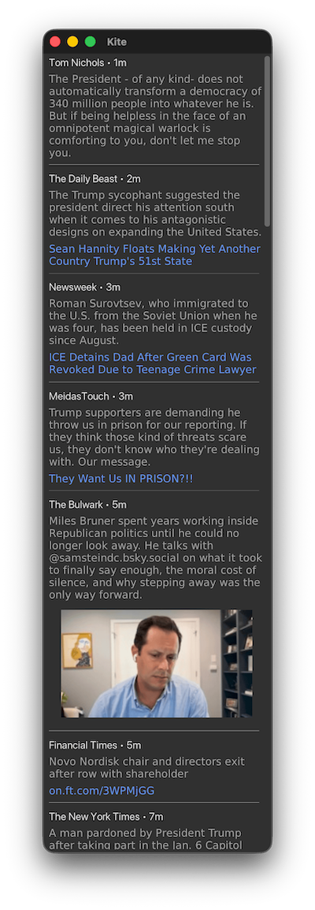

# Kite

A desktop Bluesky client built with V-lang featuring a clean GUI interface for browsing your timeline.



## Features

- 🐦 Browse your Bluesky timeline
- 🖼️ Image support with click-to-open functionality
- 🔗 Clickable links to external content
- 🔄 Repost indication
- ⏰ Relative timestamps
- 🎨 Clean, modern interface with proper text styling

## Prerequisites

- [V programming language](https://vlang.io/) installed on your system
- A Bluesky account for authentication

## Installation

1. Clone the repository:

```bash
git clone <repository-url>
cd kite
v install gui
v run .
```

On first launch, you'll need to log in with your Bluesky credentials to access your timeline.

## Project Structure

- `kite.v` - Main application entry point
- `login_view.v` - Authentication interface
- `timeline_view.v` - Timeline display components
- `timeline_logic.v` - Timeline data management
- `bsky_api.v` - Bluesky API integration
- `session.v` - Session and authentication management
- `xtra_text.v` - Text processing utilities
- `v.mod` - V module configuration

## Development

The application is built using V's GUI framework and follows a modular architecture:

- **Views**: Handle UI rendering and user interaction
- **Logic**: Manage data processing and state
- **API**: Handle external service communication
- **Utilities**: Provide common functionality like text processing

## Requirements

- V compiler (latest stable version recommended)
- GUI dependencies (handled automatically by V)
- Internet connection for Bluesky API access

## Troubleshooting

If you encounter build issues:

1. Ensure V is properly installed and up to date
2. Check that all dependencies are available
3. Try cleaning and rebuilding: `v clean && v kite.v`

For runtime issues:

- Verify your internet connection
- Check your Bluesky credentials
- Look for error messages in the console output

## License

MIT

## Contributing

Contributions are welcome! Please feel free to submit issues and pull requests.


